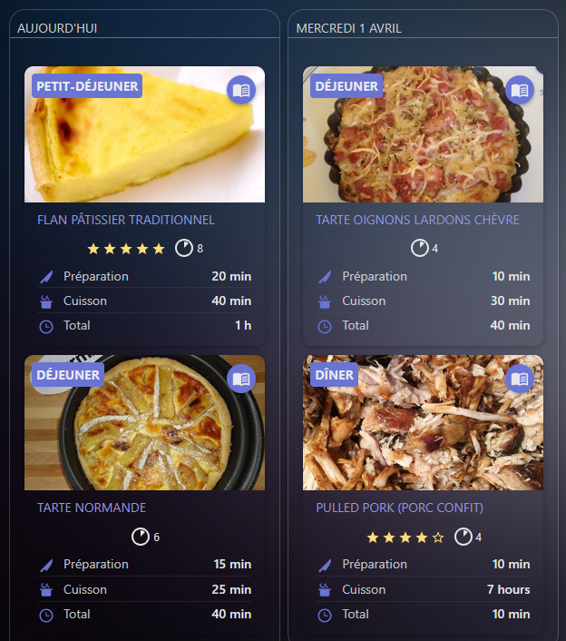
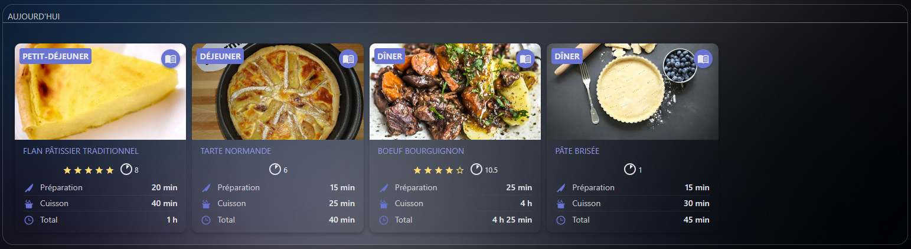
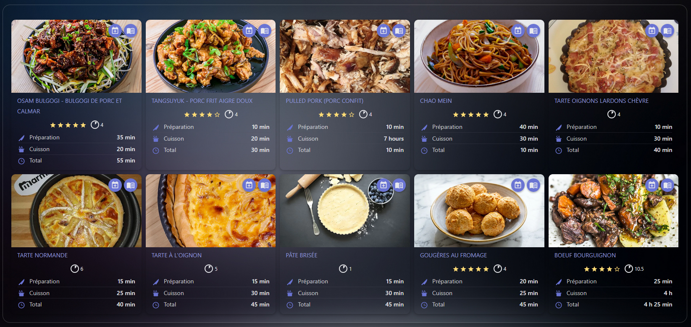
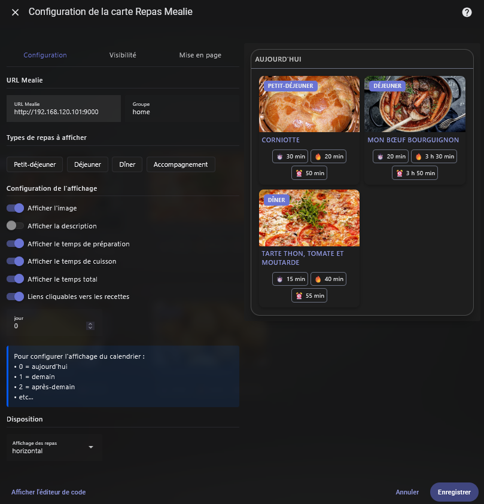
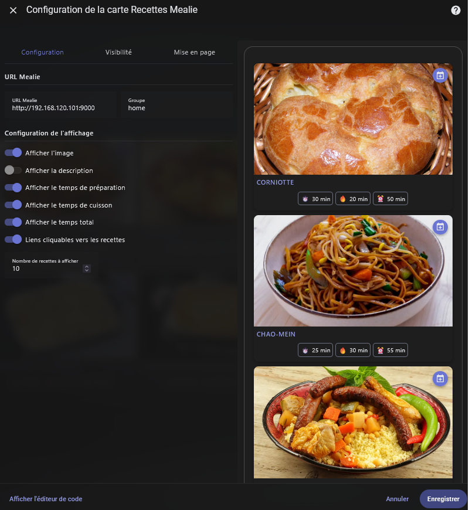

[readme.md](https://github.com/user-attachments/files/32346050/readme.md)
# Mealie Cards

[](https://github.com/custom-components/hacs)
[](https://github.com/domodom30/mealie-card/releases)

[](https://ko-fi.com/A1V11ZZTPI)

Collection of 2 custom Lovelace cards to display your Mealie recipes and meal plans in Home Assistant.

> [!NOTE]
> This fork adds a compact category selector to the recipe card. It intentionally displays no recipe tiles until a category is selected, avoiding a heavy "All categories" view.
>
> **Guide français : [installation avec HACS ou manuellement](./INSTALLATION-GITHUB-FR.md)**

## Available Cards

This package includes **two distinct cards**:

### 🍽️ Mealie Meal Card
Displays your meal plan organized by date and meal type.

 

### 📚 Mealie Recipe Card
Displays a searchable list of your Mealie recipes.



## Features

- 📅 **Meal Plan** - View your planned meals
- 🗓️ **Multi-day View** - Display up to 7 consecutive days in a single card, stacked or side by side
- 🕒 **Meal Types** - Organization by breakfast, lunch, dinner, etc.
- 📖 **Recipe List** - Browse your Mealie recipes
- 🔍 **Search** - Optional search bar to filter the recipe list
- 🗂️ **Category Filter** - Optional compact drop-down populated automatically from Mealie recipe categories
- ➕ **Add to Meal** - Button to quickly plan a recipe
- ✏️ **Edit Meal Plan** - Change the date, meal type, recipe or note of an existing entry
- 🎲 **Random Meal** - Fill a meal slot with a randomly picked recipe
- 📥 **Recipe Import** - Import a recipe into Mealie from a URL
- 🛒 **Shopping List** - Add a recipe's ingredients to a Mealie shopping list
- ❤️ **Favorites** - Toggle recipes as favorites and optionally show only favorited recipes
- 🖼️ **Images** - Optional image display (automatic proxy for legacy installations)
- ⭐ **Ratings** - Interactive star ratings, editable directly from the cards and the recipe dialog
- 🍽️ **Servings** - Display recipe servings and yield quantity
- ⏱️ **Preparation Time** - Display prep, cooking, and total time
- 🖱️ **Recipe Dialog** - Click a recipe to open a detailed dialog (ingredients, instructions)
- 🔗 **Open in Mealie** - Optionally open recipes in the Mealie web interface, either embedded in the card or in a new browser tab
- 🎨 **Visual Editor** - Full configuration via Home Assistant's graphical interface
- 🌐 **Multilingual** - Support for EN/FR/DE/ES/IT/NL/PL/PT/PT-BR/DA/RO (11 languages)


## Installation

### HACS (Recommended)

1. Open HACS in Home Assistant
2. Go to "Frontend"
3. Click the "+" button in the bottom right
4. Search for "Mealie Card"
5. Click "Install"
6. Restart Home Assistant

### Manual Installation

1. Download the `mealie-card.js` file from the [latest release](https://github.com/domodom30/mealie-card/releases)
2. Copy this file to your `config/www/` folder
3. Add the resource in Home Assistant:
   - Go to **Settings** → **Dashboards** → **Resources**
   - Click **Add Resource**
   - URL: `/local/mealie-card.js`
   - Type: **JavaScript Module**
4. Restart Home Assistant

## Prerequisites

- **Home Assistant 2025.1.0** or higher
- **Mealie Integration** configured in Home Assistant
- A working **Mealie** instance

> **Important**: These cards require the Mealie integration to be installed and configured in Home Assistant. Use `config_entry_id` to link the card to your integration.

## Configuration

### Visual Editor

Both cards include a **full visual editor**. Click ✏️ (edit) in the Lovelace interface to access graphical configuration without writing YAML.

---

### 🍽️ Meal Card

Displays your meal plan for today and/or upcoming days.



#### Complete Configuration
```yaml
type: custom:mealie-mealplan-card
config_entry_id: <your_entry_id>
day_offset: 0-6
days_layout: horizontal
days_columns: 2
entry_types:
  - breakfast
  - lunch
  - dinner
show_image: true
show_rating: true
show_servings: true
show_description: true
show_prep_time: true
show_perform_time: true
show_total_time: true
show_random_button: true
recipes_layout: horizontal
recipes_columns: 2
```

#### Configuration Options

| Option | Type | Required | Default | Description |
|--------|------|----------|---------|-------------|
| `type` | string | Yes | - | `custom:mealie-mealplan-card` |
| `config_entry_id` | string | Yes | - | ID of the Mealie integration config entry |
| `url` | string | No | - | URL of your Mealie instance — needed if images are hashes (legacy) or if the integration returns an empty `image` field, and to open recipes in Mealie |
| `recipe_view` | string | No | `dialog` | Where the *view recipe* button opens the recipe: `dialog` (inside the card), `webview` (embedded Mealie page), `browser` (new tab). Falls back to `dialog` when `url` is not set |
| `mealie_group_slug` | string | No | `home` | Group segment of the Mealie recipe URL (`/g/{group}/r/{slug}`). Only matters for unauthenticated access |
| `day_offset` | number \| string | No | `0` | Which days to display: a single offset (`0` = today, `1` = tomorrow, …) for one day, or an inclusive range such as `0-6` (today and the next 6 days) or `1-7` (tomorrow through 7 days ahead). Capped at 31 days |
| `days_to_show` | number | No | - | **Deprecated**, kept for backward compatibility. Number of days starting from `day_offset`; use a range in `day_offset` instead. Existing configs keep working, and opening the editor rewrites them to the equivalent range |
| `days_layout` | string | No | `vertical` | Layout of the day sections (`vertical` = stacked, `horizontal` = side by side) |
| `days_columns` | number | No | `2` | Number of day columns when `days_layout: horizontal`. Falls back to a single column when the card is narrower than 420px |
| `entry_types` | list | No | `[]` | Meal types to display (`breakfast`, `lunch`, `dinner`, `side`, `dessert`, `drink`, `snack`). Empty = all types |
| `show_image` | boolean | No | `false` | Display recipe images |
| `show_rating` | boolean | No | `false` | Display recipe star ratings |
| `show_servings` | boolean | No | `false` | Display recipe servings and yield quantity |
| `show_description` | boolean | No | `false` | Display recipe descriptions |
| `show_prep_time` | boolean | No | `true` | Display preparation time |
| `show_perform_time` | boolean | No | `true` | Display cooking time |
| `show_total_time` | boolean | No | `true` | Display total time |
| `show_random_button` | boolean | No | `true` | Display the random meal button in each day header. Only shown if the Mealie integration exposes the `set_random_mealplan` service |
| `show_view_recipe_button` | boolean | No | `true` | Display the *view recipe* button on each recipe tile |
| `show_shopping_list_button` | boolean | No | `true` | Display the *add to shopping list* button. Also requires the `add_recipe_to_shopping_list` service |
| `show_edit_mealplan_button` | boolean | No | `true` | Display the *edit mealplan entry* button. Also requires the `update_mealplan` service |
| `show_delete_mealplan_button` | boolean | No | `true` | Display the *delete from mealplan* button. Also requires the `delete_mealplan` service |
| `default_shopping_list_id` | string | No | `""` | Shopping list pre-selected when adding a recipe to a shopping list |
| `recipes_layout` | string | No | `vertical` | Recipe layout within each day (`vertical` or `horizontal`) |
| `recipes_columns` | number | No | `2` | Number of recipe columns when `recipes_layout: horizontal`. Falls back to a single column when the day section is narrower than 380px |

---

### 📚 Recipe Card

Displays a searchable list of your Mealie recipes.



#### Complete Configuration
```yaml
type: custom:mealie-recipe-card
config_entry_id: <your_entry_id>
result_limit: 10
show_search: true
show_categories: true
show_favorites_only: false
show_favorite: true
show_import_button: true
show_image: true
show_rating: true
show_servings: true
show_description: true
show_prep_time: true
show_perform_time: true
show_total_time: true
```

#### Configuration Options

| Option | Type | Required | Default | Description |
|--------|------|----------|---------|-------------|
| `type` | string | Yes | - | `custom:mealie-recipe-card` |
| `config_entry_id` | string | Yes | - | ID of the Mealie integration config entry |
| `url` | string | No | - | URL of your Mealie instance — needed if images are hashes (legacy) or if the integration returns an empty `image` field, and to open recipes in Mealie |
| `recipe_view` | string | No | `dialog` | Where the *view recipe* button opens the recipe: `dialog` (inside the card), `webview` (embedded Mealie page), `browser` (new tab). Falls back to `dialog` when `url` is not set |
| `mealie_group_slug` | string | No | `home` | Group segment of the Mealie recipe URL (`/g/{group}/r/{slug}`). Only matters for unauthenticated access |
| `result_limit` | number | No | `10` | Maximum number of recipes to display (1–100) |
| `show_search` | boolean | No | `false` | Display the search bar to filter recipes |
| `show_categories` | boolean | No | `false` | Display a drop-down that filters recipes by their Mealie category |
| `show_favorites_only` | boolean | No | `false` | Display only recipes marked as favorites in Mealie |
| `show_favorite` | boolean | No | `false` | Display the favorite (heart) button on recipe cards |
| `show_import_button` | boolean | No | `false` | Display the button to import a recipe from a URL |
| `default_shopping_list_id` | string | No | `""` | Shopping list pre-selected when adding a recipe to a shopping list |
| `show_image` | boolean | No | `false` | Display recipe images |
| `show_rating` | boolean | No | `false` | Display recipe star ratings |
| `show_servings` | boolean | No | `false` | Display recipe servings and yield quantity |
| `show_description` | boolean | No | `false` | Display recipe descriptions |
| `show_prep_time` | boolean | No | `true` | Display preparation time |
| `show_perform_time` | boolean | No | `true` | Display cooking time |
| `show_total_time` | boolean | No | `true` | Display total time |

---

### Opening recipes in Mealie

Set `recipe_view` to `webview` to show the Mealie page inside the card dialog, or to `browser`
to open it in a new tab. Both need `url` to point at your Mealie instance; without it the button
keeps opening the built-in dialog.

The card cannot reuse the integration's API token — it lives server-side and is never exposed to
the frontend. The embedded view relies on your browser's own Mealie session instead: if you are
already signed in, the recipe shows up; otherwise Mealie's login page appears inside the frame
and you sign in once.

For that session cookie to reach an embedded frame, **both Mealie and Home Assistant must be
served over HTTPS** — Mealie sets `SameSite=None`, which browsers only honour on secure origins,
and Home Assistant refuses to embed an `http://` page in an `https://` dashboard. When the
embedded view stays blank, use the *Open in Mealie* button in the dialog header, or switch the
card to `browser`.

`mealie_group_slug` fills the `/g/{group}/r/{slug}` path. Mealie ignores it when you are signed
in and the recipe belongs to your own group, so the `home` default fits most installations.

---

### Image Proxy (Legacy installations)

If your Mealie integration provides image identifiers as hash codes (older versions), set the `url` option to your Mealie instance URL. The card automatically detects this case and the visual editor shows the field only when needed.

```yaml
url: https://mealie.yourdomain.com
```

The `url` option is also required when the integration returns an empty `image` field for recipes that do have an image in Mealie. In that case the card rebuilds the image URL from the recipe identifier. Recipes that genuinely have no image simply display no image.

### Get Help

If you encounter issues:

- 🐛 [Report a bug](https://github.com/domodom30/mealie-card/issues/new?template=bug_report.md)
- 💡 [Request a feature](https://github.com/domodom30/mealie-card/issues/new?template=feature_request.md)
